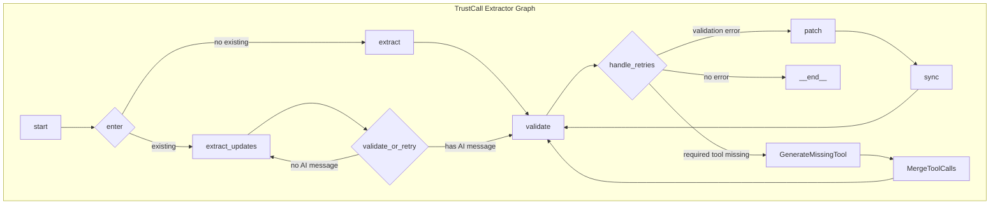

# Plan for Implementing `required_tools`

This document outlines a detailed, comprehensive plan for implementing the `required_tools` functionality in `trustcall`. This plan is designed to be consistent with the existing "patch-don't-post" philosophy by surgically adding missing tool calls rather than re-generating the entire output.

The implementation will be broken down into four main parts, touching several key files in the `trustcall` library.

1.  **API and State Management**: Update the public-facing API and the internal state management to be aware of `required_tools`.
2.  **Validation Logic**: Enhance the validation node to detect when a required tool is missing and to signal this specific error type.
3.  **Graph Modification**: Introduce a new path in the `langgraph` state machine to handle the missing tool error, including new nodes for generating and merging the missing tool call.
4.  **Documentation and Testing**: Ensure the new feature is documented and tested.

---

### Part 1: API and State Management

#### 1.1. Update `create_extractor` Signature
**File**: `trustcall/extract.py`

The `create_extractor` function will be updated to accept the `required_tools` argument. This makes the feature accessible to the user.

```python
# In trustcall/extract.py

def create_extractor(
    llm: str | BaseChatModel,
    *,
    tools: Sequence[TOOL_T],
    tool_choice: Optional[str] = None,
    required_tools: Optional[List[str]] = None,  # <-- Add this line
    enable_inserts: bool = False,
    enable_updates: bool = True,
    enable_deletes: bool = False,
    existing_schema_policy: bool | Literal["ignore"] = True,
    gemini_ref_strategy: Literal["inline", "intelligent"] = "inline",
    gemini_schema_recursion_depth: Optional[int] = None,
) -> Runnable[InputsLike, ExtractionOutputs]:
    # ...
```

This `required_tools` list will be passed down to the `_ExtendedValidationNode`.

#### 1.2. Update `ExtractionState`
**File**: `trustcall/states.py`

To support the new retry logic, we will add `required_tools` to the `ExtractionState` so it's available throughout the graph's execution.

```python
# In trustcall/states.py

@dataclass(kw_only=True)
class ExtractionState:
    messages: Annotated[List[AnyMessage], _reduce_messages] = field(
        default_factory=list
    )
    attempts: Annotated[int, operator.add] = field(default=0)
    msg_id: Annotated[str, _keep_first] = field(default="")
    existing: Optional[Dict[str, Any]] = field(default=None)
    validation_context: Annotated[Optional[Dict[str, Any]], _keep_first] = field(default=None)
    required_tools: Optional[List[str]] = field(default=None) # <-- Add this line
```

---

### Part 2: Validation Logic

#### 2.1. Enhance `_ExtendedValidationNode`
**File**: `trustcall/validation.py`

The validation node is where the core check will happen.

1.  **Update `__init__`**: The constructor will accept and store `required_tools`.

    ```python
    # In trustcall/validation.py _ExtendedValidationNode
    def __init__(self, *args, enable_deletes: bool = False, required_tools: Optional[List[str]] = None, **kwargs):
        super().__init__(*args, **kwargs)
        self.enable_deletes = enable_deletes
        self.required_tools = required_tools
    ```

2.  **Update `_func`**: The main validation function will be modified to perform the check *after* all existing tool calls have been validated.

    ```python
    # In trustcall/validation.py _ExtendedValidationNode._func
    def _func(self, input: Any, config: RunnableConfig) -> Any:
        # ... existing logic to get message and run validation ...
        outputs = [*executor.map(run_one_extended, message.tool_calls)]

        # <-- Start of new logic -->
        if self.required_tools:
            called_tool_names = {tc['name'] for tc in message.tool_calls}
            is_missing = not any(req_tool in called_tool_names for req_tool in self.required_tools)

            if is_missing:
                # Signal a specific error that the graph can route on
                outputs.append(ToolMessage(
                    content=f"Validation failed: A tool from the required list {self.required_tools} was not called.",
                    name="RequiredToolMissing",
                    tool_call_id="--sentinel-for-missing-tool--",
                    additional_kwargs={"is_error": True, "is_missing_tool_error": True}
                ))
        # <-- End of new logic -->

        if output_type == "list":
            return outputs
        else:
            return {"messages": outputs}
    ```

---

### Part 3: Graph Modification

This is the most significant part of the implementation, involving changes to the state machine inside `create_extractor`.

**File**: `trustcall/extract.py`

#### 3.1. New Graph Nodes

We will define two new nodes within the `create_extractor` function.

1.  **`GenerateMissingTool` Node**: This node will be responsible for prompting the LLM to generate only the missing tool call.

    ```python
    # In trustcall/extract.py
    def generate_missing_tool_node(state: ExtractionState) -> dict:
        # Logic to construct a prompt asking the LLM to generate the missing tool call,
        # providing the original conversation and the already validated tool calls as context.
        # ...
        # Invoke the LLM
        # ...
        # Return the new AIMessage with the missing tool call
        return {"messages": [new_ai_message]}
    ```

2.  **`MergeToolCalls` Node**: This node will merge the newly generated tool call with the previously validated ones.

    ```python
    # In trustcall/extract.py
    def merge_tool_calls_node(state: ExtractionState) -> dict:
        # Logic to find the original AIMessage and the new AIMessage,
        # extract the tool calls from both, and create a new AIMessage
        # with the merged list of tool calls.
        # ...
        return {"messages": [merged_ai_message]}
    ```

#### 3.2. Update Conditional Routing

The `handle_retries` function will be updated to route to the new nodes based on the error type.

```python
# In trustcall/extract.py
def handle_retries(state: ExtractionState, config: RunnableConfig) -> Union[Literal["__end__"], list]:
    # ... existing logic ...
    for m in reversed(state.messages):
        if isinstance(m, ToolMessage):
            if m.additional_kwargs.get("is_missing_tool_error"):
                # Route to the new node
                return [Send("generate_missing_tool", state)]
            elif m.additional_kwargs.get("is_error"):
                # Existing route for validation errors
                # ...
```

#### 3.3. Updated Graph Structure

The `StateGraph` will be updated to include the new nodes and edges.

```python
# In trustcall/extract.py
# ...
builder.add_node("generate_missing_tool", generate_missing_tool_node)
builder.add_node("merge_tool_calls", merge_tool_calls_node)
# ...
# Update conditional edges from 'validate'
builder.add_conditional_edges(
    "validate",
    handle_retries,
    path_map={
        "__end__": "__end__",
        "patch": "patch",
        "del_tool_call": "del_tool_call",
        "generate_missing_tool": "generate_missing_tool" # New path
    }
)
# Add new edges
builder.add_edge("generate_missing_tool", "merge_tool_calls")
builder.add_edge("merge_tool_calls", "validate") # Loop back for validation
```

#### 3.4. Visualizing the New Graph

Here is a Mermaid diagram illustrating the new, more complex graph structure.



---

### Part 4: Documentation and Testing

1.  **Update Docstrings**: The docstring for `create_extractor` will be updated to explain the new `required_tools` parameter and its behavior.
2.  **Add Unit Tests**: New unit tests will be created in `tests/unit_tests/` to verify:
    *   The extractor works as expected when `required_tools` are present.
    *   The new retry path is correctly triggered when a required tool is missing.
    *   The graph correctly generates, merges, and validates the missing tool call.
    *   The extractor gracefully handles cases where the LLM fails to generate the missing tool after retries.