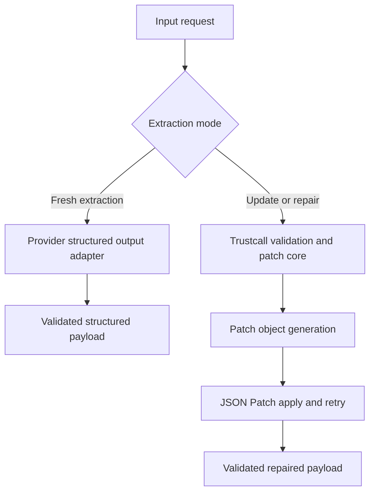

# Plan: Gemini Structured Output Simplification for Trustcall

## Goal and capability gained

Primary goal: simplify Gemini support in [`trustcall/extract.py`](trustcall/extract.py), [`trustcall/schema.py`](trustcall/schema.py), [`trustcall/patch.py`](trustcall/patch.py), and [`trustcall/validation.py`](trustcall/validation.py) by replacing obsolete GAPIC-era complexity with a provider-aware architecture that uses native structured outputs where they are the better fit.

Capability gained:
- cleaner Gemini support with less provider-specific schema transformation
- a more reliable fresh-extraction path for Gemini
- retention of trustcall's patch-don't-regenerate value for update and repair flows
- a provider-neutral core that can support Gemini, OpenAI, and Anthropic without forcing one transport pattern onto all of them

## Non-goals

- Do not remove trustcall's validation and JSON Patch repair model.
- Do not redesign the library around a synthetic heterogeneous wrapper schema in the first pass.
- Do not preserve old Gemini complexity unless current provider behavior still requires it.
- Do not force all providers onto one identical invocation mechanism.

## Constraints

- Trustcall's differentiator is reliable repair, not just schema extraction.
- The first simplification pass should minimize surface area and avoid a large multi-axis refactor.
- Gemini is the primary provider target.
- The resulting design should still make sense for OpenAI and Anthropic.

## Evidence base

### Confirmed provider guidance

#### Gemini

- Official Google docs distinguish native structured outputs from function calling: structured outputs are for schema-constrained final responses, while function calling is for actions during the conversation.
- LangChain's Google integration now defaults [`with_structured_output()`](https://docs.langchain.com/oss/python/integrations/chat/google_generative_ai) to JSON schema mode.
- The migration announcement for `langchain-google-genai` confirms the move to the unified `google-genai` SDK and deprecates the old Gemini-on-Vertex path as the primary integration model.

#### OpenAI

- OpenAI's official docs distinguish JSON-schema response formatting from function calling in the same way: structured outputs for final responses, function calling for tool and app actions.

#### Anthropic

- Anthropic's official docs support both native structured outputs and strict tool use, and explicitly state that they solve different problems and can be combined.

### Repo-verified current state

The current Gemini-specific complexity exists in:

- schema transformation in [`trustcall.schema._get_schema()`](trustcall/schema.py:191) and [`trustcall.schema._transform_schema_for_gemini_recursive()`](trustcall/schema.py:91)
- GAPIC compatibility logic in [`trustcall.utils._make_schema_gapic_compatible()`](trustcall/utils.py:139)
- Vertex monkey-patching in [`trustcall.utils._patch_vertexai_for_gemini_ref()`](trustcall/utils.py:248)
- Gemini-specific tool wrapping in [`trustcall.extract._Extract.__init__()`](trustcall/extract.py:85)
- Gemini-specific tool-choice workarounds in [`trustcall.extract._ExtractUpdates.__init__()`](trustcall/extract.py:158) and [`trustcall.patch._Patch.__init__()`](trustcall/patch.py:51)
- the Gemini function-call bypass in [`trustcall.extract.filter_state()`](trustcall/extract.py:1156)

The core trustcall value that should remain is centered in:

- validation in [`trustcall.validation._ExtendedValidationNode._func()`](trustcall/validation.py:251)
- patch generation contracts in [`trustcall.schema._create_patch_function_errors_schema()`](trustcall/schema.py:336) and [`trustcall.schema._create_patch_doc_schema()`](trustcall/schema.py:364)
- patch normalization in [`trustcall.schema._ensure_patches()`](trustcall/schema.py:458)
- patch application in [`trustcall.patch._apply_patch()`](trustcall/patch.py:387)
- message mutation and retry flow in [`trustcall.patch._infer_patch_message_ops()`](trustcall/patch.py:321) and [`trustcall.extract.create_extractor()`](trustcall/extract.py:597)

### Historical context from existing plans

#### [`docs/intelligent_inlining_plan.md`](docs/intelligent_inlining_plan.md)

This plan shows that the current Gemini schema pipeline was designed around old `$ref` and GAPIC constraints. It explicitly routes selective inlining through [`trustcall.schema._get_schema()`](trustcall/schema.py:191) and then through [`trustcall.utils._make_schema_gapic_compatible()`](trustcall/utils.py:139). That is evidence that much of the current schema complexity exists to satisfy historical Gemini transport limitations, not trustcall's core repair model.

#### [`docs/required_tools_plan.md`](docs/required_tools_plan.md)

This plan explains why the graph now contains the missing-tool generation and merge path. The resulting flow in [`trustcall.extract.generate_missing_tool_node()`](trustcall/extract.py:891) and [`trustcall.extract.merge_tool_calls_node()`](trustcall/extract.py:919) was added to preserve the patch-don't-post philosophy within a tool-calling architecture. That history matters because it shows how much complexity was introduced by modeling extraction as tool use.

## Provider-by-provider decisions

### Gemini

#### Fresh extraction

Use native structured outputs for fresh extraction when the request is to return a schema-constrained final payload.

Rationale:
- this matches official provider intent
- this targets the exact area where Gemini has improved most
- this reduces dependency on historical Vertex and GAPIC workarounds

#### Dynamic heterogeneous extraction

Do not make dynamic heterogeneous multi-schema extraction via native structured output the first migration target.

Rationale:
- provider docs are strongest for one final schema-constrained response
- trustcall's current multi-schema semantics map naturally to multiple tool calls
- replacing this immediately would require inventing a synthetic wrapper contract, which increases migration scope at the wrong time

Decision:
- single-schema fresh extraction should move first
- fixed wrapper-schema structured extraction can be considered later
- dynamic heterogeneous extraction can remain on tool-calling semantics initially

#### Patch flow

Keep the patch contract, but move patch generation toward native structured outputs behind a provider adapter boundary after fresh extraction is simplified.

Rationale:
- patch objects are structured responses, not external actions
- the existing JSON Patch application model remains valuable
- this preserves trustcall's core capability while reducing transport-specific complexity

#### Filter-state bypass

Remove the Gemini function-call bypass in [`trustcall.extract.filter_state()`](trustcall/extract.py:1156) after the new structured-output path is validated against current runtime behavior.

### OpenAI

Treat OpenAI conceptually the same as Gemini for architecture purposes:
- native structured output for final payload generation
- tool calling only where the model is actually choosing or invoking actions

OpenAI does not drive the first implementation step because the immediate simplification opportunity is Gemini-specific.

### Anthropic

Treat Anthropic the same way conceptually:
- native structured output is valid for final payloads
- strict tool use remains appropriate for action-oriented flows

Anthropic should remain behind an adapter boundary because its API and SDK ergonomics differ from Gemini and OpenAI.

## Target-state architecture

### Core principle

The correct abstraction for trustcall is no longer "tool calling everywhere".

The correct split is:
- final structured payload generation uses native structured outputs when the provider supports them well
- action selection and external tool orchestration use tool calling
- repair and update semantics remain trustcall-native and provider-neutral

### Core and adapter split

#### Provider-neutral core

The core should own:
- validation rules
- retry policy
- patch normalization
- patch application
- message and state mutation
- response metadata normalization

#### Provider adapters

Adapters should own:
- native structured-output invocation
- tool-calling fallback where still needed
- any remaining provider-specific schema transformation that is verified to still be necessary

## Proposed changes

### Change 1: Split fresh extraction from repair mode

Refactor the architecture around two conceptual modes in [`trustcall.extract.create_extractor()`](trustcall/extract.py:597):

- fresh extraction mode
- update and repair mode

This split should be architectural, not just conditional branching buried inside Gemini-specific logic.

### Change 2: Move Gemini fresh extraction to native structured output

For Gemini fresh extraction:
- prefer native structured outputs for single-schema extraction
- stop modeling this path as fake tool use by default

This should become the primary Gemini path.

### Change 3: Preserve the current patch semantics initially

Do not replace:
- [`trustcall.schema._create_patch_function_errors_schema()`](trustcall/schema.py:336)
- [`trustcall.schema._create_patch_doc_schema()`](trustcall/schema.py:364)
- [`trustcall.schema._ensure_patches()`](trustcall/schema.py:458)
- [`trustcall.patch._apply_patch()`](trustcall/patch.py:387)
- the validation and retry flow in [`trustcall.validation._ExtendedValidationNode._func()`](trustcall/validation.py:251)

These remain the heart of trustcall's reliability model.

### Change 4: Migrate patch generation transport later

After fresh extraction is simplified, move patch generation away from patch-as-tool-call and toward provider-native structured outputs.

The internal patch object contract should stay the same. Only the transport used to obtain that contract should change.

### Change 5: Introduce provider-neutral schema generation plus optional adapters

Refactor [`trustcall.schema._get_schema()`](trustcall/schema.py:191) so that:
- provider-neutral schema generation is separate from provider adaptation
- any remaining Gemini-specific schema adaptation is isolated and justified by current behavior

### Change 6: Remove obsolete Gemini and GAPIC helpers after validation

Re-evaluate and likely remove or deprecate:
- [`trustcall.utils._patch_vertexai_for_gemini_ref()`](trustcall/utils.py:248)
- [`trustcall.schema._transform_schema_for_gemini_recursive()`](trustcall/schema.py:91)
- [`trustcall.utils._make_schema_gapic_compatible()`](trustcall/utils.py:139)
- the Gemini-specific branch in [`trustcall.extract._Extract.__init__()`](trustcall/extract.py:85)
- the Gemini bypass in [`trustcall.extract.filter_state()`](trustcall/extract.py:1156)

### Change 7: Prevent new Gemini architecture from depending on merge-based tool recovery

The missing-tool flow added through [`trustcall.extract.generate_missing_tool_node()`](trustcall/extract.py:891) and [`trustcall.extract.merge_tool_calls_node()`](trustcall/extract.py:919) may remain valid for legacy tool-call extraction, but it should not shape the new Gemini fresh-extraction path.

## Suggested execution order

1. Architecturally split fresh extraction from repair mode in [`trustcall.extract.create_extractor()`](trustcall/extract.py:597)
2. Move Gemini single-schema fresh extraction to native structured output
3. Validate removal of the Gemini bypass in [`trustcall.extract.filter_state()`](trustcall/extract.py:1156)
4. Introduce provider-neutral schema generation with provider adapters
5. Migrate patch generation transport from tool calling to structured output
6. Prune obsolete Gemini, Vertex, and GAPIC helpers

## Mermaid overview

## Acceptance criteria

- Gemini single-schema fresh extraction works without relying on GAPIC monkey-patching or Gemini-specific fake-tool wrapping.
- The patch loop still repairs invalid outputs using the current internal JSON Patch semantics.
- Patch generation is no longer permanently tied to tool-call transport semantics.
- [`trustcall.extract.filter_state()`](trustcall/extract.py:1156) no longer needs the Gemini function-call bypass.
- Any remaining Gemini-specific code is justified by current SDK behavior rather than historical Vertex limitations.
- The trustcall core is provider-neutral, with provider differences isolated behind adapters.

## Validation plan

### Gemini

- Validate single-schema fresh extraction using native structured output with a simple schema.
- Validate single-schema fresh extraction using native structured output with a nested schema.
- Validate update-existing flows still work with the patch contract from [`trustcall.schema._create_patch_doc_schema()`](trustcall/schema.py:364).
- Validate repair flows still work with the patch contract from [`trustcall.schema._create_patch_function_errors_schema()`](trustcall/schema.py:336).
- Confirm the new primary Gemini path does not rely on the bypass in [`trustcall.extract.filter_state()`](trustcall/extract.py:1156).

### OpenAI

- Validate no regression on current trustcall behavior.
- Validate that the adapter split does not assume Gemini-specific semantics.

### Anthropic

- Validate no regression on current trustcall behavior.
- Validate that provider adapters can express native structured output and strict tool use separately.

## Risks and failure modes

### Medium: hidden dependency on old Gemini bypass behavior

The Gemini bypass in [`trustcall.extract.filter_state()`](trustcall/extract.py:1156) may still cover runtime combinations not visible from current code inspection alone.

### Medium: schema-adapter overreach

Removing [`trustcall.schema._transform_schema_for_gemini_recursive()`](trustcall/schema.py:91) and [`trustcall.utils._make_schema_gapic_compatible()`](trustcall/utils.py:139) too early could break provider compatibility if some remaining path still depends on them.

### Low: temporary coexistence of two extraction transports

During migration, fresh extraction and repair may use different provider transport patterns. This is acceptable as long as the internal trustcall contract stays coherent.

## What not to do

- Do not replace trustcall with plain provider-native structured extraction and remove repair semantics.
- Do not make dynamic heterogeneous structured extraction the first migration target.
- Do not keep Gemini-specific GAPIC and Vertex workarounds by default just because they were historically necessary.
- Do not let the legacy missing-tool merge flow dictate the architecture of the new Gemini path.

## Final recommendation

The recommended target state is:

- native structured outputs for final structured payload generation
- tool calling only where the model is truly choosing or invoking actions
- a provider-neutral trustcall core with provider adapters
- single-schema Gemini fresh extraction as the first simplification target
- patch generation transport migrated later, without changing the internal patch contract

This is the smallest coherent plan that removes the most obsolete Gemini complexity while preserving trustcall's core objective.
