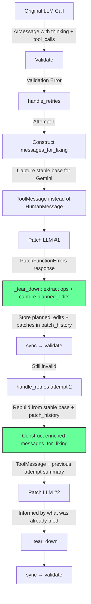
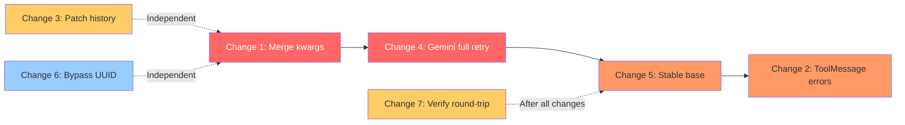

# Plan: Preserving Thought Signatures Across Patch Retries

## Project Objective
trustcall is an experimental library focused on reliable structured output extraction from LLMs, using JSON Patch operations for error correction and schema updates. The core principle is "patch-don't-post" — fixing errors cheaply rather than regenerating entire outputs.

## The Question
When trustcall patches a failed tool call and that patch *itself* fails validation, should the second patch attempt include the thought signatures/reasoning from the first? And are thought signatures correctly preserved through the current flow at all?

## Primary Provider Focus: Gemini 3 Pro/Flash
Secondary: Anthropic Claude 4.5/4.6 family, OpenAI GPT-5.2

---

## 1. Current Model Landscape — Thought Signatures (Feb 2026)

All three major providers have converged on the same pattern: thinking output is exposed with cryptographic signatures that must be preserved for multi-turn tool use.

### 1.1 Google Gemini 3 Pro/Flash — PRIMARY

- `thinking_level` parameter: `minimal`, `low`, `medium`, `high`
- `thoughtSignature` — encrypted representation of the model's internal reasoning
- **Strictly enforced for function calling:** Missing signatures on the current turn → 400 error. From Google's developer blog: "Function Calling has strict validation on the current turn. Missing signatures will result in a 400 error."
- For text/chat: omitting signatures degrades quality but doesn't error
- From DataCamp tutorial: "The tool loop must pass them back exactly as received, or function calling can fail, even at `thinking_level='minimal'`"
- Official SDKs handle signature round-tripping automatically from content blocks
- LangChain stores signatures in `AIMessage.content` blocks (as `extras.signature`) and potentially in `additional_kwargs`

### 1.2 Anthropic Claude Opus 4.6 / Sonnet 4.5 / Haiku 4.5

- **Adaptive thinking** replaces binary on/off. Four effort levels: `low`, `medium`, `high` (default), `max`
- Encrypted `signature` field in thinking blocks
- Multi-turn tool use: thinking blocks with signatures MUST be sent back. Missing → 400 error
- **Key behavior:** "Thinking blocks from previous turns are removed from context" — the model literally cannot see thinking from prior turns. Only the current/last assistant turn's thinking is visible
- API automatically filters previous-turn thinking blocks for billing

### 1.3 OpenAI GPT-5.2 / GPT-5.2-Codex

- `reasoning.effort` parameter: `none` (default for 5.2), `minimal`, `low`, `medium`, `high`, `extra_high`
- Reasoning now partially visible via `reasoning_details` array — containing summaries and cryptographic signatures
- OpenRouter docs: "preserve the complete `reasoning_details` when passing messages back to the model so it can continue reasoning from where it left off"
- LangChain exposes via `content_blocks` with type `"reasoning"` + summary blocks

### 1.4 LangChain Standardization

All three providers' thinking outputs normalize through `AIMessage.content_blocks` into `ReasoningContentBlock` representations. The raw provider formats in `AIMessage.content` are preserved as-is for round-tripping.

---

## 2. Current Patch Flow — Tracing Thought Signature Preservation

### 2.1 The Three Paths Through Trustcall

```mermaid
flowchart TD
    subgraph Path A - Fresh Extraction
        A1[_Extract.invoke] -->|AIMessage with thinking + tool_calls| A2[validate]
        A2 -->|error| A3[handle_retries]
        A3 -->|messages_for_fixing via validation_context| A4[_Patch.invoke]
        A4 -->|MessageOps update original AIMessage| A5[sync → validate]
    end

    subgraph Path B - Update Existing
        B1[_ExtractUpdates.invoke] -->|_teardown creates NEW AIMessage| B2[validate]
        B2 -->|error| B3[handle_retries]
        B3 -->|messages_for_fixing via validation_context| B4[_Patch.invoke]
    end
    
    subgraph Patch Retry Loop
        P1[_Patch bound LLM call] -->|PatchFunctionErrors tool call| P2[_tear_down: extract ops]
        P2 -->|MessageOps modify original AIMessage tool_calls only| P3[sync]
        P3 --> P4[validate]
        P4 -->|still invalid| P5[handle_retries]
        P5 -->|new messages_for_fixing| P1
    end
```



### 2.2 Path A — Fresh Extraction: Signatures ARE Preserved ✅

1. [`_Extract._tear_down()`](trustcall/extract.py:124) passes the AIMessage through unmodified — `content` (with thinking blocks + signatures) intact
2. The AIMessage is stored in state with all content preserved
3. [`_Patch._tear_down()`](trustcall/patch.py:69) uses [`_apply_message_ops()`](trustcall/states.py:34) which does `m.model_copy()` — a shallow copy that preserves `content` and `additional_kwargs`
4. Only `tool_calls` are modified on the copy — signatures in `content` survive ✅

### 2.3 Path B — Update Existing: Signatures PARTIALLY Lost ⚠️

[`_ExtractUpdates._teardown()`](trustcall/extract.py:357) creates a **new** AIMessage:

```python
ai_message = AIMessage(
    content=msg.content,              # ← thinking blocks in content preserved ✅
    tool_calls=resolved_tool_calls,
    id=msg.id,
    usage_metadata=msg.usage_metadata,
    response_metadata=msg.response_metadata,
    additional_kwargs={"updated_docs": updated_docs},  # ← OVERWRITES all original kwargs ⚠️
)
```

- `content` is preserved → text-block signatures survive ✅
- `additional_kwargs` is overwritten with only `{"updated_docs": ...}` → any provider-specific metadata stored there (e.g., Gemini's function-call-level thought signatures) is lost ⚠️
- Whether this causes actual failures depends on whether the Gemini SDK reconstructs signatures from `content` alone or also needs `additional_kwargs` data — this needs verification during implementation

### 2.4 The `messages_for_fixing` Construction — What the Patch LLM Sees

In [`handle_retries()`](trustcall/extract.py:1020):

```python
messages_for_fixing = (
    state.messages[: last_ai_message_index + 1]
    + [HumanMessage(content=error_content)]
)
```

**What the patch LLM receives:**
1. Original user/system messages ✅
2. Original AIMessage with thinking blocks + tool_calls ✅ (content preserved through message ops)
3. **HumanMessage** with validation error details

**Provider-specific implications of using HumanMessage:**

| Provider | Effect | Impact |
|----------|--------|--------|
| **Gemini 3** | Signatures are in the AIMessage content. Gemini validates signatures on the "current turn" (the response being generated), not on history. Previous-turn signatures contribute to reasoning quality but don't cause hard failures when in history | Quality may degrade but no 400 errors. Signatures in the AIMessage ARE present in the request |
| **Claude 4.5/4.6** | The HumanMessage creates a new conversational turn. Anthropic's API **automatically removes thinking blocks from previous turns from context**. The model literally cannot see the original extraction's reasoning | Thinking context **lost** — model must re-derive reasoning from scratch |
| **GPT-5.2** | Reasoning details handling is API-level. HumanMessage should not strip them from history | Minimal impact |

---

## 3. Critical Evaluation of Provided Analysis

The provided analysis raises several valid points. Here's my assessment of each claim:

### 3.1 VERIFIED: `_ExtractUpdates._teardown()` overwrites `additional_kwargs`

**Status: Confirmed.** Line 363 of [`extract.py`](trustcall/extract.py:363) creates `additional_kwargs={"updated_docs": updated_docs}`, discarding the original message's `additional_kwargs`. This is a real issue for any provider storing signature data in kwargs.

**Severity for Gemini 3:** Needs verification. The `langchain-google-genai` SDK may reconstruct signatures from `content` blocks alone, making this a latent issue that works today but could break with SDK changes. Regardless, merging kwargs is the correct defensive approach.

### 3.2 PARTIALLY ACCURATE: HumanMessage strips Claude thinking from retries

**Status: Correct for Claude, overstated for Gemini.** 

For **Claude**: The Anthropic API docs confirm "thinking blocks from previous turns are removed from context." A HumanMessage after the AIMessage starts a new turn, so thinking IS stripped. The ToolMessage alternative IS valid — a tool_result keeps us in the same tool-use turn, preserving thinking blocks.

For **Gemini 3**: The strict validation is on the "current turn" (the response), not on the history. Signatures in the AIMessage history contribute to quality but their absence doesn't cause 400 errors in the history. The ToolMessage change would still improve quality but isn't a correctness fix for Gemini.

### 3.3 ACCURATE: Previous patch reasoning is lost across retries

**Status: Confirmed.** The patch LLM's AIMessage (including its thinking, `planned_edits`, and patches) is consumed in `_tear_down()` only for its `MessageOp` effects. The response itself is never stored. On retry, the next patch LLM invocation has no knowledge of what was previously attempted.

### 3.4 CONFIRMED: Gemini `__gemini_function_call_thought_signatures__` key

**Status: Confirmed by LangChain docs.** The [LangChain Google GenAI integration docs](https://docs.langchain.com/oss/python/integrations/chat/google_generative_ai) explicitly state:

> Signatures appear in two places in `AIMessage` responses:
> - Text blocks: Stored in `extras.signature` within the content block
> - Tool calls: Stored in `additional_kwargs["__gemini_function_call_thought_signatures__"]`

The `langchain-google-genai` SDK source also contains the constant `_FUNCTION_CALL_THOUGHT_SIGNATURES_MAP_KEY`. This confirms the key name and means the `additional_kwargs` overwrite in `_ExtractUpdates._teardown()` (Issue 3.1) definitively destroys Gemini tool-call-level thought signatures.

### 3.5 CONFIRMED: Surgical retry + merge creates Gemini-invalid AIMessage

**Status: Confirmed.** The GPT analysis correctly identified that [`merge_tool_calls_node()`](trustcall/extract.py:884) creates a brand new AIMessage by merging tool_calls from TWO separate LLM responses. While it does merge `additional_kwargs` (`{**original.additional_kwargs, **new.additional_kwargs}`), the resulting AIMessage represents a `functionCall` arrangement that **never existed in any real model output**.

For Gemini 3, thought signatures are tied to the specific functionCall parts the model generated. A merged AIMessage's signature mapping won't align with the merged tool_call structure. Additionally, the surgical retry path (line 1010-1013) strips ToolMessages but keeps the AIMessage, creating a history where an assistant functionCall turn lacks corresponding functionResponse turns — another Gemini-invalid state.

**Severity:** HIGH for Gemini 3, but only on the `required_tools` path when the LLM misses a required tool.

### 3.6 VALID: Mutated state in `messages_for_fixing` may misalign with signatures

**Status: Uncertain but defensively valid.** On follow-up patch attempts, `messages_for_fixing` is built from `state.messages[:last_ai_message_index + 1]`. The AIMessage in state has had its `tool_calls` args mutated by previous patches via `_apply_message_ops`. If Gemini's signature validation ties the signature to the original functionCall parts, the mutated args could cause a mismatch.

**My evaluation:** Thought signatures likely cover the model's reasoning/thinking, not the tool call argument values themselves. The model generated thinking → tool_calls, and the signature was produced before args were even validated. Patching only changes args within existing tool calls, not the structural arrangement of which calls exist. However, a defensive fix (capturing a stable base) is cheap and safe regardless.

**Severity:** LOW-MEDIUM — defensive fix is cheap.

### 3.7 CONFIRMED: Bypass path reconstructs ToolCall with random UUID

**Status: Confirmed.** In [`filter_state()`](trustcall/extract.py:1127), when `msg.additional_kwargs["function_call"]` exists (Gemini bypass), a new ToolCall is constructed with `id=str(uuid.uuid4())`. If `__gemini_function_call_thought_signatures__` maps signatures by call_id, this severs the association.

**Severity:** LOW — this is in `filter_state` (post-processing after the graph completes), NOT in the retry loop. It doesn't affect signature preservation during retries, but may affect downstream consumers.

### 3.8 EVALUATED: "Always include thought signatures" recommendation

**Status: Nuanced.** The analysis says "yes, always." My evaluation:

- **For the original extraction's thinking → patch LLM:** Yes, preserving is beneficial. It gives the patch LLM context about *why* the original tool call was generated the way it was
- **For a patch LLM's thinking → next patch LLM:** The value is real but modest. Each patch call is independent — the model primarily needs: (a) the current broken state, (b) the current error, (c) what was already tried. The full thinking is less critical than the `planned_edits` and patch ops
- **The `planned_edits` + patches approach is complementary, not competing:** Including `planned_edits` history AND preserving thinking blocks from the original extraction covers both layers

---

## 4. Recommended Changes — Prioritized

### Change 1: Preserve `additional_kwargs` in `_ExtractUpdates._teardown()` (HIGH — Gemini correctness)

**What:** Merge kwargs instead of overwriting in [`_ExtractUpdates._teardown()`](trustcall/extract.py:357-363)

**Why:** Prevents loss of provider-specific metadata (thought signatures, etc.) through the update-existing path. One-line change, no downside, defensive correctness.

**Scope:** [`_ExtractUpdates._teardown()`](trustcall/extract.py:363) — change `additional_kwargs={"updated_docs": updated_docs}` to merge with original kwargs

### Change 2: Use ToolMessage instead of HumanMessage for validation errors (HIGH — Claude correctness, Gemini quality)

**What:** In [`handle_retries()`](trustcall/extract.py:1020), deliver validation errors as `ToolMessage` instead of `HumanMessage` in `messages_for_fixing`

**Why:** 
- **Claude:** A ToolMessage keeps the error within the same tool-use turn, preserving thinking block visibility. With HumanMessage, thinking is stripped by the API and the patch LLM loses the original extraction's reasoning context
- **Gemini 3:** Maintains proper tool-use flow structure. Thought signatures stay in the natural tool loop sequence (AIMessage with tool_calls → ToolMessage with result → next generation)
- **General:** Using ToolMessage with `tool_call_id=failed_tool_call_id` is semantically correct — the validation error IS the result of calling that tool

**Scope:** [`handle_retries()`](trustcall/extract.py:1020-1022) — change `HumanMessage(content=error_content)` to `ToolMessage(content=error_content, tool_call_id=m.tool_call_id)` 

**Consideration:** When there are multiple failed tool_calls, each gets a separate `Send("patch", ...)`. Each patch call's `messages_for_fixing` should include the ToolMessage for its specific failed tool_call_id. This already works since `m.tool_call_id` is available in the loop.

**Additional consideration:** If the AIMessage has multiple tool_calls and we only provide a ToolMessage for the ONE that failed, some providers may require ToolMessages for ALL tool_calls. This needs to be tested per-provider. If needed, we could add "success" ToolMessages for the non-failed tool calls.

### Change 3: Include previous patch attempt context (MEDIUM — quality improvement, all providers)

**What:** When constructing `messages_for_fixing` for attempt ≥ 2, include a summary of what was previously tried and failed.

**Why:** Without this, the patch LLM may repeat the same failed approach. The `planned_edits` field already contains human-readable reasoning about what was attempted, and the patch operations show exactly what changes were made.

**What to include:**
- The `planned_edits` string from the previous patch attempt (model-agnostic reasoning summary)
- The patch operations that were applied (`[{op, path, value}, ...]`)  
- The error that resulted from those patches
- An explicit instruction to try a different approach

**What NOT to include:**
- Full thinking blocks from previous patch attempts (too large, provider-specific, anchoring risk)
- Full AIMessage from the previous patch (unnecessary overhead)

**Scope:**
1. Add a `patch_history` field to [`ExtractionState`](trustcall/states.py:162) to accumulate attempt summaries
2. In [`_Patch._tear_down()`](trustcall/patch.py:69), extract `planned_edits` and patches from the patch LLM's tool_calls and return them for state storage
3. In [`handle_retries()`](trustcall/extract.py:1016), when constructing `messages_for_fixing` for attempt ≥ 2, append the patch history as additional context

### Change 4: Use Full Retry for Missing-Tool on Gemini (HIGH — Gemini correctness)

**What:** When `is_gemini_model(llm)` is true and the `is_missing_tool_error` path triggers, always take the "full retry" branch (strip both AIMessage and ToolMessage, re-run extract from scratch) rather than the "surgical retry" branch (generate_missing_tool → merge).

**Why:** The surgical retry + merge path synthesizes an AIMessage with a tool_call arrangement that never existed in any real model output. This breaks Gemini 3's thought signature validation because signatures are tied to the specific functionCall parts the model generated. The full retry path is safe because it starts fresh.

**Scope:** [`handle_retries()`](trustcall/extract.py:1004-1014) — when `is_missing_tool_error` is true and model is Gemini, always use the full retry branch regardless of `is_empty_response`

**Design note:** The `using_gemini` flag is computed in `create_extractor` and `handle_retries` is defined within that scope, so `using_gemini` is already available via closure.

### Change 5: Stable Base History for Multi-Attempt Patching (MEDIUM — Gemini defensive)

**What:** For Gemini, capture the original (pre-mutation) messages as a stable base on the first patch attempt. Subsequent attempts rebuild `messages_for_fixing` from this base instead of from the mutated state.

**Why:** Even though arg mutation probably doesn't invalidate signatures (since signatures cover thinking, not args), this is a cheap defensive measure. It ensures the original AIMessage — with its exact thought signature structure — is always used as the anchor for patch prompts. It also means each patch attempt sees the same stable context, differing only in the error message.

**Scope:** [`handle_retries()`](trustcall/extract.py:1016-1032) — store `__base_messages_for_fixing` in validation_context on first error, reuse on subsequent errors. Only append the current error and patch history to the stable base.

### Change 6: Gemini Bypass Path — Reuse Signature-Map Key (LOW — Gemini post-processing)

**What:** In `filter_state`'s Gemini bypass path, if `__gemini_function_call_thought_signatures__` exists in `additional_kwargs` and has exactly one key, use that key as the reconstructed tool_call_id instead of generating a random UUID.

**Why:** Preserves the association between the thought signature and the tool call for downstream consumers.

**Scope:** [`filter_state()`](trustcall/extract.py:1127) — check for signature map key before falling back to `uuid.uuid4()`

### Change 7: Evaluate Removing the Gemini Schema Transformer (MEDIUM — simplification)

**What:** Assess whether trustcall's manual Gemini schema transformation layer is still needed given improvements in `langchain-google-genai >= 3.1.0`, Gemini 3's improved JSON handling, and the fact that `GeminiJsonPatch` is already aliased to `FullPatch`.

**Why:** The Gemini transformer adds significant complexity. Several parts are already no-ops:
- `GeminiJsonPatch = FullPatch` — the Gemini-specific patch class is eliminated
- `get_patch_class(for_gemini)` returns the same class regardless
- `_create_patch_function_errors_schema(using_gemini)` and `_create_patch_doc_schema(using_gemini)` produce identical schemas

The remaining active Gemini-specific code includes:
- Schema transformation: type uppercasing, `$ref` inlining, field filtering, nullable union collapsing
- Manual tool wrapping in `_Extract.__init__` instead of using `llm.bind_tools()` directly
- GAPIC compatibility layer and VertexAI monkey-patch
- Gemini bypass path in `filter_state` for `additional_kwargs["function_call"]`

If `langchain-google-genai >= 3.1.0` now handles schema transformation internally, all of this manual transformation is redundant complexity that:
- Creates additional surface area for bugs (like the `additional_kwargs` overwrite)
- Makes the codebase harder to maintain
- May conflict with SDK-level improvements

**Scope:**
1. Test `llm.bind_tools(tools)` directly with Gemini 3 Pro/Flash WITHOUT `for_gemini=True` — does it work?
2. Check if the SDK's `_dict_to_gapic_schema` now handles `$ref`, `oneOf`, nullable unions, etc. natively
3. Check if tool_calls now come back in `msg.tool_calls` instead of `additional_kwargs["function_call"]` (eliminating the bypass path)
4. If SDK handles everything: remove `for_gemini` branching, schema transformer, GAPIC compatibility layer, bypass path
5. If SDK handles MOST things: identify the minimal remaining transformations needed

**Risk assessment:** This is a SEPARATE investigation from the thought signature changes. It should be done after the correctness fixes (Changes 1-6) are in place, since removing the transformer is a larger refactor that needs thorough testing.

### Change 8: Verify Gemini Thought Signature Round-Tripping (MEDIUM — validation)

**What:** Verify the full signature lifecycle through the extract → validate → patch → validate cycle with Gemini 3.

**Why:** Now that the key name `__gemini_function_call_thought_signatures__` is confirmed, we should verify:
- Signatures survive `_apply_message_ops` correctly
- The merged kwargs from Change 1 actually prevent the `_ExtractUpdates` path from breaking
- The `langchain-google-genai` SDK can reconstruct from content blocks alone (as a fallback) or requires `additional_kwargs`

**Scope:** Manual testing / integration test with Gemini 3

---

## 5. Testing Strategy

### How to Deterministically Trigger Patches

The existing `FakeExtractionModel` already supports this pattern:
- `responses` — returned by the extraction LLM (first `bind_tools` call)
- `backup_responses` — returned by the patch LLM (second `bind_tools` call)

To guarantee a patch occurs, construct an initial AIMessage with tool_calls that will **fail** Pydantic validation. The validator produces an error ToolMessage, `handle_retries` sends it to the patch node, and the patch LLM returns a `PatchFunctionErrors` tool call (from `backup_responses`) that fixes the issue.

### Test Scenarios for Thought Signatures

**Test A: Signatures survive the extract → validate → patch → validate cycle**
1. Create AIMessage with:
   - `content` containing thinking blocks with `extras.signature` (Gemini-style text signatures)
   - `additional_kwargs["__gemini_function_call_thought_signatures__"]` with a mock signature map
   - `tool_calls` with args that FAIL validation (e.g., missing required field)
2. Set `backup_responses` to return a valid `PatchFunctionErrors` fix
3. After extraction, verify:
   - The final AIMessage still has thinking blocks in `content`
   - `additional_kwargs` still contains the signature map
   - The tool_call args are correctly patched

**Test B: Signatures survive through `_ExtractUpdates._teardown()` (update-existing path)**
1. Same as Test A, but invoke with `existing` data to trigger Path B
2. Verify that `additional_kwargs` is merged (not overwritten) after Change 1

**Test C: `planned_edits` context included on second patch attempt**
1. Create an AIMessage whose tool_calls fail validation
2. Set `backup_responses` to return a `PatchFunctionErrors` that ALSO fails validation (e.g., incorrect patch path)
3. Set further `backup_responses` to return a valid fix
4. Verify that the second patch attempt's `messages_for_fixing` includes the `planned_edits` and patches from the first attempt

**Test D: Stable base history for Gemini**
1. Same multi-attempt scenario as Test C
2. Verify that on the second patch attempt, `messages_for_fixing` starts from the original (unmutated) AIMessage, not the patched one

### How to Make a Pydantic Model That Deterministically Fails

Use a `@field_validator` that rejects specific values:

```python
class StrictUser(BaseModel):
    name: str
    age: int
    
    @field_validator('age')
    @classmethod
    def age_must_be_positive(cls, v):
        if v < 0:
            raise ValueError("age must be positive")
        return v
```

Then have the extraction LLM return `{"name": "Alice", "age": -1}` — this will always fail, triggering a patch.

---

## 6. Design Decisions

| Decision | Choice | Rationale |
|----------|--------|-----------|
| Deliver errors as ToolMessage or HumanMessage? | **ToolMessage** | Preserves thinking context for Claude, maintains proper tool-use flow for Gemini, semantically correct |
| Store full thinking blocks from patch attempts? | **No** | Too large, provider-specific, anchoring risk. Store `planned_edits` + patches instead |
| Store `planned_edits` from previous patches? | **Yes** | Already exists, model-agnostic, cheap, prevents repetition of failed approaches |
| Merge vs overwrite `additional_kwargs`? | **Merge** | No downside, preserves provider metadata, defensive correctness |
| Gemini missing-tool recovery? | **Full retry only** | Surgical retry + merge creates AIMessage that never existed, breaking thought signatures |
| Stable base history for Gemini? | **Yes** | Cheap defensive measure, ensures original signatures anchor all patch attempts |
| Change the graph structure? | **No** | Same nodes, same edges. Changes are within existing node implementations |

---

## 6. Flow After Changes



---

## 7. Implementation Priority



**Legend:** 🔴 HIGH priority | 🟠 HIGH-MEDIUM | 🟡 MEDIUM | 🔵 LOW

---

## 8. Acceptance Criteria

- [ ] `_ExtractUpdates._teardown()` merges `additional_kwargs` instead of overwriting
- [ ] Validation errors are delivered as `ToolMessage` with the correct `tool_call_id`, not `HumanMessage`
- [ ] Multi-tool-call scenarios are handled (ToolMessages provided for all tool_calls when required by provider)
- [ ] Missing-tool recovery uses full retry (not surgical + merge) for Gemini models
- [ ] `merge_tool_calls_node` is not invoked for Gemini models
- [ ] A stable base history is captured on first patch error and reused for subsequent attempts (Gemini)
- [ ] `ExtractionState` has a field to track patch attempt history
- [ ] `_Patch._tear_down()` captures and returns `planned_edits` and patches for state storage
- [ ] On patch attempt ≥ 2, `messages_for_fixing` includes a summary of previous attempts with instruction to try differently
- [ ] Gemini bypass path reuses signature-map keys as tool_call_id when available
- [ ] Gemini 3 thought signature round-tripping is verified through the full extract → validate → patch → validate cycle
- [ ] All changes work across Gemini 3, Claude 4.5/4.6, and GPT-5.2
- [ ] Existing tests continue to pass
